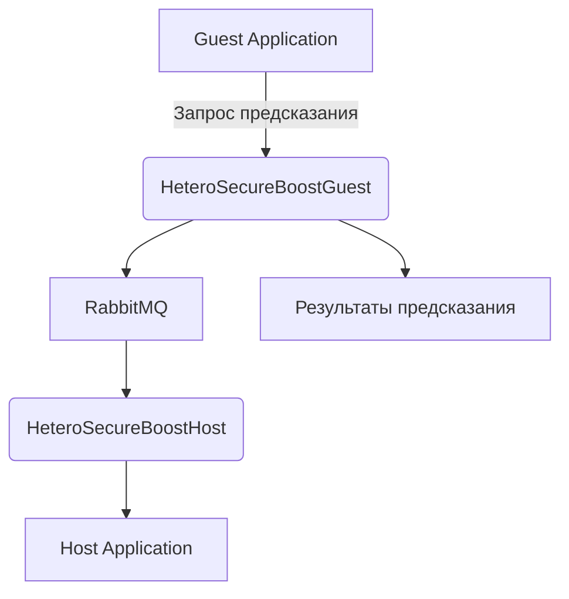
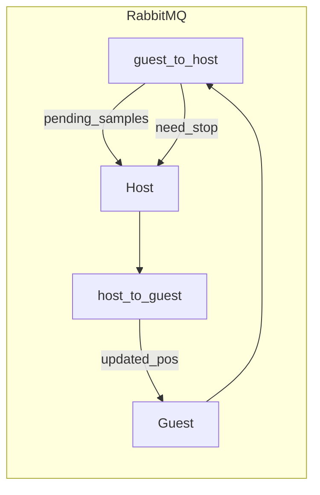
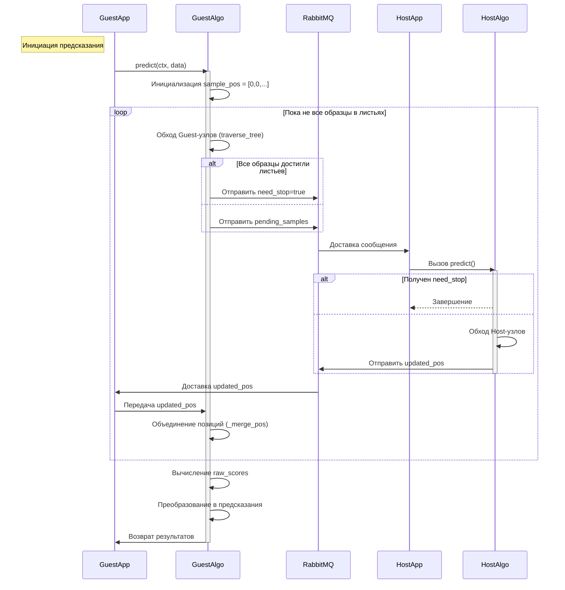

# ОКБ: Вертикальное федеративное обучение. Описание процесса предсказания.

## Общая архитектура

Система реализует процесс предсказания (predict/inference) со следующими участниками:

- **Активная сторона (Guest)**: Система которая выступает инициатором предсказания и координирует процесс.
- **Пассивная сторона (Host)**: Имеет которая выступает донором модели с дополнительными признаками (фичами).
- **RabbitMQ**: Брокер сообщений для обмена данными между участниками.





## Компоненты используемые для предсказания

| Класс                   | Роль                                                     |
| ----------------------- | -------------------------------------------------------- |
| HeteroSecureBoostGuest  | Главный API класс предсказания для Guest                 |
| HeteroSecureBoostHost   | Главный API класс предсказания для Host                  |
| predict_leaf_guest      | Модуль ядра предсказания с основной логикой для Guest    |
| predict_leaf_host       | Модуль ядра предсказания с основной логикой для Host     |


## Активная сторона (Guest)

### Методы и последовательность вызовов

1. **do_predict()** - входная точка:

- Создание контекста выполнения (`create_ctx()`)
- Загрузка данных (`content_to_df()`)
- Инициализация предсказания (`boost.predict()`)
- Сохранение результатов

2. **HeteroSecureBoostGuest.predict()** :

```python
def predict(ctx, data):
    leaf_pos = predict_leaf_guest(ctx, self._trees, data)
    raw_scores = self._sum_leaf_weights(leaf_pos)
    return self._loss_func.predict(raw_scores)
```

3. **predict_leaf_guest()** - основной алгоритм:

```python
while True:
    # 1. Локальный обход деревьев
    new_pos = traverse_tree(trees, data, sample_pos)
    
    # 2. Проверка завершения
    if all_reach_leaf(new_pos):
        ctx.hosts.put("need_stop", True)
        break
        
    # 3. Отправка образцов на Host
    ctx.hosts.put("pending_samples", pending_samples)
    
    # 4. Получение обновленных позиций
    host_pos = ctx.hosts.get("updated_pos")
    sample_pos = _merge_pos(sample_pos, host_pos)
```

4. **Обогащение на Guest**:
    - Объединение позиций: _merge_pos(pending_samples, updated_pos)
    - Вычисление предсказаний:
    ```python
    raw_scores = self._sum_leaf_weights(leaf_pos, trees, learning_rate)
    result = self._loss_func.predict(raw_scores)
    ```

5. **После завершения всех итераций**
```python
task_type, classes = self.get_task_info()
result_frame = compute_predict_details(raw_scores, task_type, classes)
# result_frame содержит итоговые предсказания
```


### **Коммуникация с Host**

| **Действие** | **Тип сообщения**  | **Параметры**                 | **Назначение**                        |
|--------------|--------------------|-------------------------------|----------------------------------------|
| Отправка     | `pending_samples`  | `sample_id`, `current_positions` | Образцы для обработки на Host         |
| Отправка     | `need_stop`        | `boolean`                     | Сигнал завершения процесса            |
| Получение    | `updated_pos`      | `sample_id`, `new_positions` | Результаты обработки Host             |


### Особенности

- **Данные не шифруются**: Передаются только индексы образцов и позиции в деревьях
- Guest хранит веса листьев и вычисляет финальные предсказания
- Управляет процессом предсказания

## Пассивная сторона (Host)

### Методы и последовательность вызовов

1. **do_predict()** - входная точка:
    - Создание контекста
    - Передача управления `boost.predict()`

2. **HeteroSecureBoostHost.predict()**:

```python
def predict(ctx, data):
    predict_leaf_host(ctx, self._trees, data)
```

3. **predict_leaf_host()** - обработчик запросов:

```python
while True:
    need_stop = ctx.guest.get("need_stop")
    if need_stop: break
    
    pending_samples = ctx.guest.get("pending_samples")
    # Вычисление новых позиций
    new_pos = traverse_tree(trees, data, pending_samples)
    ctx.guest.put("updated_pos", new_pos)
```

### **Коммуникация с Guest**

| **Действие** | **Тип сообщения**   | **Параметры**               | **Назначение**                      |
|--------------|---------------------|------------------------------|--------------------------------------|
| **Получение** | `pending_samples`   | `sample_id`, `positions`     | Запрос на обработку образцов        |
| **Получение** | `need_stop`         | `boolean`                    | Команда остановки                   |
| **Отправка**  | `updated_pos`       | `sample_id`, `positions`     | Результаты обработки                |


### Особенности

- Обрабатывает только образцы, достигшие своих узлов
- Не имеет доступа к весам листьев и финальным предсказаниям
- Не требует шифрования (работает с индексами)

## RabbitMQ: Маршрутизация сообщений

### Сообщения  и параметры




| **Сообщение**     | **Exchange**      | **Routing Key**      | **Параметры**                      |
|-------------------|-------------------|-----------------------|------------------------------------|
| `pending_samples` | `guest_to_host`   | `host.{party_id}`     | `sample_id`, `current_positions`   |
| `need_stop`       | `guest_to_host`   | `broadcast`           | `true`/`false`                     |
| `updated_pos`     | `host_to_guest`   | `guest.{party_id}`    | `sample_id`, `new_positions`       |


### Особенности

- VHost изоляция: Каждая сессия использует отдельный виртуальный хост
- Автоматическое создание очередей при инициализации
- Гарантированная доставка сообщений

## Детализированная схема выполнения




## Детализированная схема выполнения совместимая с https://www.sequencediagram.org/
[predict_diagramm](res/predict_diagramm.txt)


## Особенности безопасности

1. **Отсутствие передачи признаков**:
	- Host получает только индексы образцов и позиции в деревьях
	- Guest не получает никаких данных от Host кроме позиций

2. **Изоляция модельных параметров**:
	- Веса листьев хранятся только на Guest
	- Host не имеет доступа к финальной модели

3. **Контроль доступа**:
	- RabbitMQ использует отдельные учетные записи для каждой сессии
	- Автоматическая очистка ресурсов после завершения

4. **Защита от перехвата**:
	- Виртуальные хосты изолируют трафик между сессиями
	- Отсутствие чувствительных данных в сообщениях