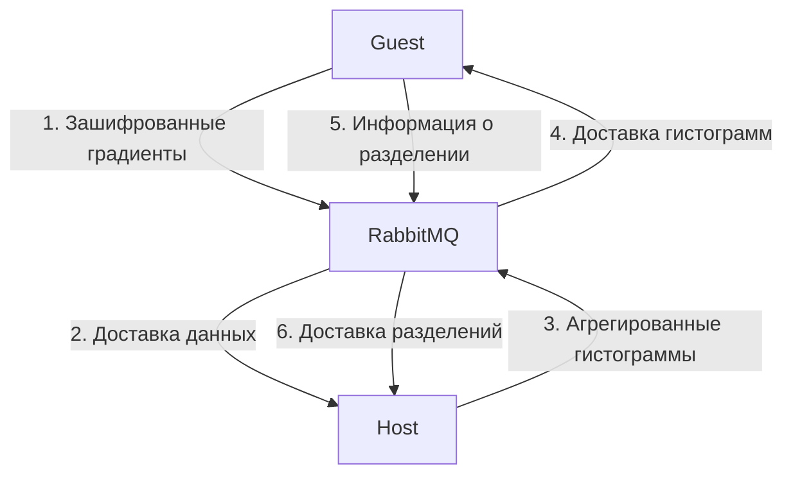
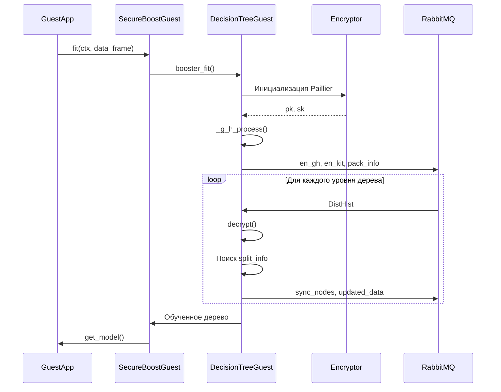
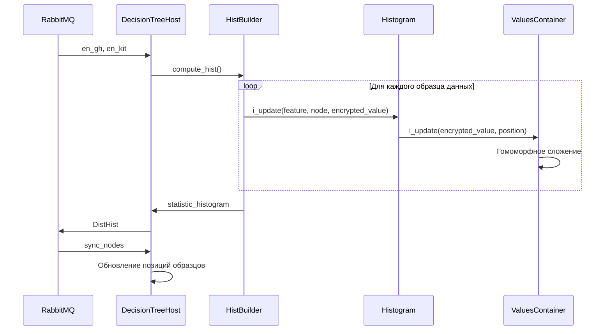
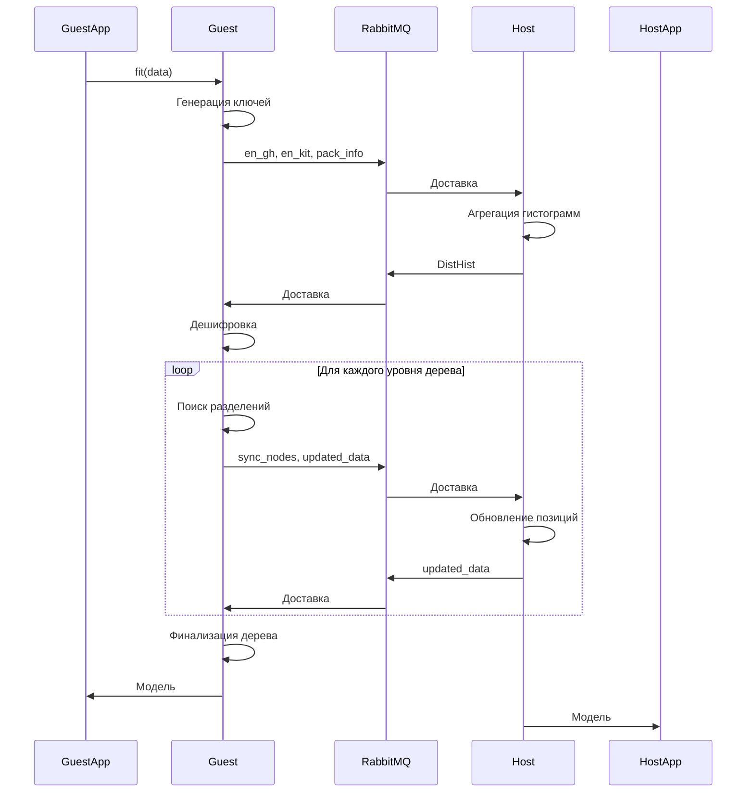
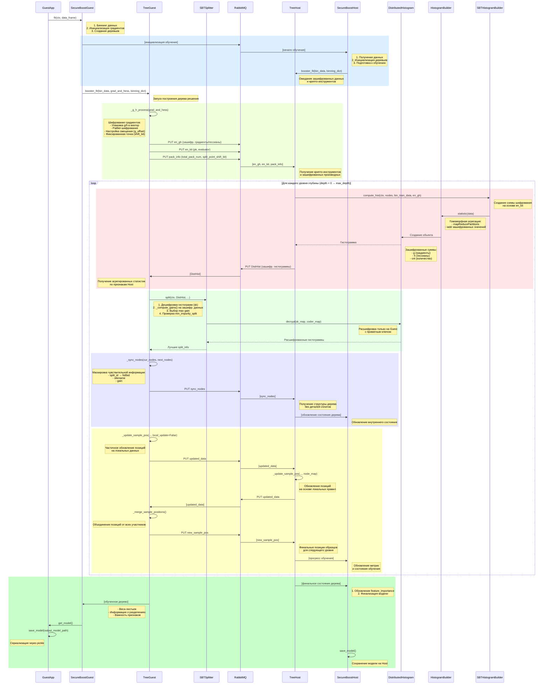

# ОКБ: Вертикальное федеративное обучение. Описание процесса обучения.

# Общая архитектура процесса

Система реализует вертикальное федеративное обучение с использованием алгоритма SecureBoost. В системе участвуют:

- **Активная сторона (Guest)**: Имеет доступ как к признакам (фичам), так и целевым меткам (таргетам). Координирует обучение. Выполняет шифрование/дешифрование.
- **Пассивная сторона (Host)**: Имеет доступ только к признакам (фичам). Выполняет вычисления на гомоморфно зашифрованных данных.
- **RabbitMQ**: Брокер сообщений для обмена данными между участниками.
- **Гомоморфное шифрование Paillier**: Обеспечивает конфиденциальность данных.

## Компоненты используемые для обучения

| Класс                   | Роль                                |
| ----------------------- | ----------------------------------- |
| HeteroSecureBoostGuest  | Главный API класс обучения на Guest |
| HeteroDecisionTreeGuest | Построение деревьев на Guest        |
| HeteroSecureBoostHost   | Главный API класс обучения на Host  |
| HeteroDecisionTreeHost  | Построение деревьев на Host         |
| SBTHistogramBuilder     | Построение гистограмм на Host       |
| SBTSplitter             | Поиск точек разделения              |
| DistributedHistogram    | Хранение зашифрованных статистик    |
| RabbitManager           | Работа с RabbitMQ                   |
| RabbitmqFederation      | Управление защищенной коммуникацией |

## Криптографические компоненты

| Компонент          | Назначение                    |
| ------------------ | ----------------------------- |
| PHETensorEncryptor | Шифрование тензоров           |
| PHETensorDecryptor | Дешифрование тензоров         |
| PHETensorCoder     | Упаковка/распаковка значений  |
| PHETensorCipher    | Управление ключами шифрования |


## Общая схема взаимодействия участников


# Процесс активного обучения на стороне Guest

## Инициализация

1. Генерация ключей Paillier (открытый `pk` и секретный `sk`).
2. Биннинг данных и инициализация градиентов.

## Шифрование данных

```python
### Шифрование градиентов и гессианов
def _g_h_process(grad_and_hess):
    # 1. Упаковка g/h
    pack_tensor = torch.Tensor([g + g_offset, h])
    
    # 2. Преобразование в фиксированную точку
    pack_vec = coder.pack_floats(
        pack_tensor, 
        shift_bit, 
        pack_num=2, 
        precision=FIX_POINT_PRECISION
    )
    
    # 3. Шифрование Paillier
    en = pk.encrypt_encoded(pack_vec, obfuscate=True)
    return en
```

### Дешифровка данных (гистограмм)
```python
def split(ctx, statistic_histogram):
    # 1. Дешифровка с использованием sk
    decrypted_hist = statistic_histogram.decrypt(
        sk_map={"gh": self._sk},
        coder_map={"gh": (self._coder, torch.float32)}
    )
    
    # 2. Поиск оптимального разделения
    for feature, bin in decrypted_hist:
        gain = self._compute_gain(hist[feature][bin])
        if gain > best_gain and gain > min_impurity_split:
            best_split = (feature, bin)
    
    return best_split
```
## Основной цикл обучения

1. **Отправка данных  на сторону Host**:

- `en_gh`: Зашифрованные градиенты/гессианы
- `en_kit`: Открытый ключ и evaluator
- `pack_info`: Параметры упаковки

2. **Получение гистограмм**:

- Получает `DistHist` от Host (агрегированные зашифрованные гистограммы)

3. **Дешифровка и поиск разделений**:

- Дешифровка с использованием секретного ключа `sk`

- Поиск лучшего разделения по критерию gain

4. **Синхронизация**:

- Отправка маскированной структуры дерева (`sync_nodes`)

- Обновление позиций образцов (`updated_data`)

## Финализация

- Сохранение модели: `save_model(output_model_path)`

## Схема активного обучения на стороне Guest




# Процесс пассивного обучения на стороне Host

## Инициализация

1. Получение зашифрованных градиентов (`en_gh`) и криптоинструментов (`en_kit`).

2. Инициализация гистограмм.

## Гомоморфная агрегация
Host выполняет **только операции сложения** на зашифрованных данных:

```python
class HistogramValuesContainer:
    def i_update(self, targets, positions):
        for name, value in targets.items():
            # Делегирование операции соответствующему типу значений
            self._data[name].i_update(value, positions)
    
    def iadd(self, other: "HistogramValuesContainer"):
        for name, values in other._data.items():
            if name in self._data:
                self._data[name].iadd(values)
```
```python
class HistogramEncryptedValues:
    def i_update(self, value, positions):
        for pos in positions:
            # Гомоморфное сложение: E(a) + E(b)
            self.data[pos] = self.evaluator.add(self.pk, self.data[pos], value)
    
    def iadd(self, other):
        for i in range(len(self.data)):
            # Гомоморфное сложение массивов
            self.data[i] = self.evaluator.add(self.pk, self.data[i], other.data[i])
```
## Основной цикл обучения

1. **Построение гистограмм**:

- Агрегация зашифрованных значений по бинам и узлам дерева.

- Возврат сжатых гистограмм (`DistHist`) на Guest.

2. **Получение информации о разделении**:

- Получает `sync_nodes` от Guest (маскированная структура дерева).

3. **Обновление позиций образцов**:

- Локальное обновление позиций на основе правил разделения.

- Отправка обновленных позиций (`updated_data`).

## Особенности работы

- **Безопасность**: Host никогда не видит расшифрованные градиенты.

- **Эффективность**: Используется пакетная обработка и сжатие данных.

## Схема пассивного обучения на стороне Host



# Взаимодействие участников через RabbitMQ

## Типы сообщений

| Тип          | Направление      | Описание                           | Шифрование    |
|--------------|------------------|------------------------------------|----------------|
| **en_gh**    | Guest → Host   | Зашифрованные градиенты            | Paillier       |
| **en_kit**   | Guest → Host   | pk, evaluator                      | Открытый ключ  |
| **pack_info**| Guest → Host   | Параметры упаковки                 | Открытый текст |
| **DistHist** | Host → Guest   | Агрегированные гистограммы         | Paillier       |
| **sync_nodes**| Guest → Host | Маскированная структура дерева     | Открытый текст |
| **updated_data** | Обе стороны  | Обновленные позиции образцов      | Открытый текст |


## Управление очередями

```python
class RabbitManager:
    def create_queue(vhost, queue_name): ...
    def bind_exchange_to_queue(vhost, exchange, queue): ...
    def federate_queue(upstream, vhost, send_q, receive_q): ...
    def put(key, value): ...  # Отправка сообщения
    def get(key, timeout=None): ...  # Получение сообщения
```

## Детали шифрования и безопасности

### Схема шифрования Paillier

- **Гомоморфные свойства**: Поддерживает сложение зашифрованных значений.
- **Упаковка данных**: Несколько значений упаковываются в одно число для эффективности.
- **Фиксированная точка**: Преобразование чисел с плавающей точкой в целые для шифрования.

### Параметры безопасности

- **Длина ключа**: 1024 бита (по умолчанию).
- **Обфускация**: Добавление случайного шума при шифровании.
- **Маскировка метаданных**: Скрытие чувствительной информации о дереве.

# Диаграммы

## Общая схема обучения




## Детализированная схема обучения



## Детализированная схема обучения совместимая с https://www.sequencediagram.org/
[train_diagramm](res/train_diagramm.txt)

# Заключение

Система обеспечивает конфиденциальность данных за счет использования гомоморфного шифрования и безопасного обмена сообщениями. Guest координирует обучение и выполняет криптографические операции, в то время как Host участвует в вычислениях, не имея доступа к сырым данным.